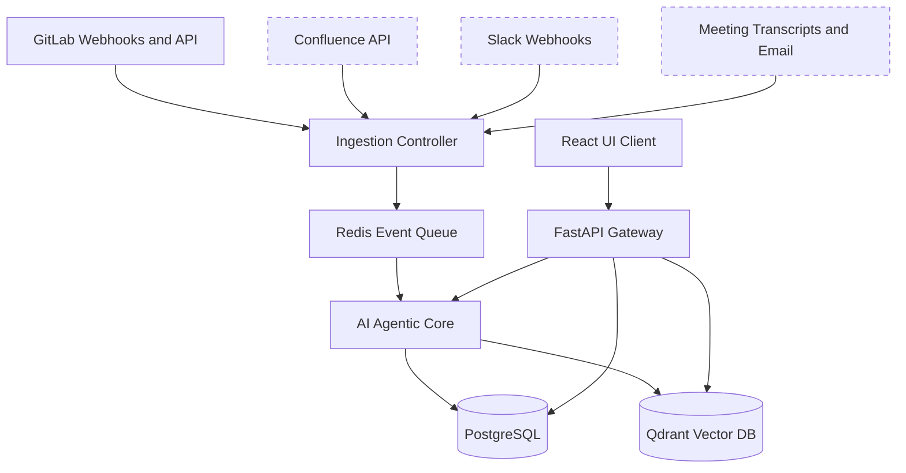

# Axis

**AI-powered alignment engine for software teams.**

Axis continuously ingests project activity from GitLab (and soon Slack, Confluence, email), reconstructs feature-level context, tracks requirement evolution, and surfaces relevant changes to the right people.

---

## 📌 The Problem

Modern software teams operate across highly fragmented tools:
* **Information Silos:** Requirements reside in GitLab, decisions in Confluence, approvals in email, clarifications in Slack, and code in pull requests.
* **Human Context Relays:** Product Owners and senior developers waste significant bandwidth manually repeating feature context across roles.
* **Propagation Failures:** Downstream dependencies (e.g., frontend contracts, QA test cases) are rarely updated when upstream requirements change, resulting in late-stage sprint failures and rework.
* **Version Amnesia:** The reasoning behind historical trade-offs, approvals, and decisions is lost over time, leading to tribal knowledge dependency and onboarding friction.

---

## 💡 The Solution & Core Concept

Axis replaces manual communication channels with a system-owned source of truth:
1. **Multisource Ingestion:** Connects directly to project spaces via webhooks, REST APIs, and event streams.
2. **Feature Intelligence Graph:** Instead of static folders, Axis links requirements, decisions, commits, API schemas, and stakeholders into an evolving semantic network.
3. **Multi-Agent Processing:** 
   - *LLM Classifier Agent:* Tags and maps incoming event streams to features.
   - *Conflict Detection Agent:* Flags discrepancies between discussions (e.g., Slack threads) and formal specifications.
   - *Impact Analysis Engine:* Maps dependencies and identifies stakeholders affected by an upstream change.
4. **Context-Aware Delivery:** Delivers precise conversational answers via an AI Chat Interface, role-aware dashboard summaries, and impact-specific alerts.


*\* Coming soon*

---

## 🔌 Connectors & Plugin System

Axis features an extensible connector architecture. Adding a new integration requires implementing the standard interface in a single directory:

```
backend/app/connectors/
├── base.py              # BaseConnector interface definition
├── registry.py          # Auto-discovers and registers plugins
├── gitlab/
│   ├── client.py        # GitLab API client wrapper
│   └── connector.py     # Implements BaseConnector
├── slack/               # Future: just add this folder
│   └── connector.py
└── confluence/          # Future: just add this folder
    └── connector.py
```

---

## ⚡ Quick Start

### 1. Start Infrastructure
Run the database, vector store, and queue via Docker Compose:
```bash
docker compose up -d
```
This launches **PostgreSQL** (with pgvector), **Redis**, and **Qdrant**.

### 2. Set Up the Backend
```bash
cd backend
python -m venv .venv

# Activate Virtual Environment
# Windows:
.venv\Scripts\activate
# Linux/Mac:
# source .venv/bin/activate

# Install dependencies and setup environment
pip install -e ".[dev]"
cp .env.example .env
```
*Note: Edit the newly created `.env` file with your credentials (e.g. GitLab PAT, Gemini API keys).*

### 3. Run the Backend Server
```bash
uvicorn app.main:app --reload --port 8000
```

### 4. Set Up & Run the Frontend
```bash
cd ../frontend
npm install
npm run dev
```

---

## 🛠️ API Reference

| Category | Method | Path | Description |
|---|---|---|---|
| **Health** | `GET` | `/api/health` | System health check and registered connectors. |
| **Auth** | `GET` | `/api/auth/login/{type}` | Starts OAuth flow for the connector. |
| **Auth** | `GET` | `/api/auth/callback/{type}` | OAuth callback. |
| **Auth** | `GET` | `/api/auth/connectors` | List currently active connectors. |
| **Projects** | `POST` | `/api/projects/` | Create a new project workspace. |
| **Projects** | `POST` | `/api/projects/{id}/connect` | Connect a connector source to a project. |
| **Projects** | `POST` | `/api/projects/{id}/sync` | Trigger a manual full synchronization. |
| **Projects** | `GET` | `/api/projects/{id}/status` | Check project sync status. |
| **Search** | `GET` | `/api/search/?q=...&project_id=...` | Perform semantic and hybrid searches. |
| **AI Chat** | `POST` | `/api/chat/query` | Submit a prompt to the conversational RAG agent. |
| **Graph** | `GET` | `/api/graph/features/{feature_id}/context` | Get full graph context for a specific feature. |
| **Graph** | `GET` | `/api/graph/traverse` | Run BFS graph traversal starting from any node. |
| **Documents** | `POST` | `/api/documents` | Upload external document chunks directly. |
| **Webhooks** | `POST` | `/api/webhooks/{type}/{project_id}` | Webhook payload receiver endpoint. |

---

## 💻 Tech Stack

* **Backend:** FastAPI (Python)
* **Databases:** PostgreSQL (Relational + Graph relationships), Qdrant (Vector search engine)
* **Queue & Cache:** Redis + Celery
* **AI Models:** Google Gemini (`text-embedding-004` & `gemini-1.5-pro`/`flash`)
* **AI Orchestration:** LangGraph / LlamaIndex pipelines
* **Frontend:** React, TypeScript, Vite, Vanilla CSS (Premium glassmorphic interface with canvas-based graph visualization)

---

## 📁 Project Directory Structure

```
Axis/
├── backend/
│   ├── app/
│   │   ├── main.py              # FastAPI entrypoint
│   │   ├── config.py            # Configuration & environment settings
│   │   ├── database/            # Database initialization and clients
│   │   ├── models/              # SQLAlchemy & ORM models
│   │   ├── api/                 # Endpoint routers (chat, graph, projects, search)
│   │   ├── connectors/          # Integration adapters (GitLab, Slack, etc.)
│   │   └── services/            # Core business logic (RAG pipeline, graph ingestion)
│   ├── tests/                   # Pytest suite
│   ├── pyproject.toml           # Python package requirements
│   └── .env.example
├── frontend/
│   ├── src/
│   │   ├── components/          # Reusable UI components
│   │   ├── App.tsx              # Main chat application dashboard
│   │   ├── index.css            # Styling system tokens
│   │   └── types/               # TypeScript definitions
│   ├── package.json
│   └── vite.config.ts
├── docker-compose.yml           # Infrastructural containers setup
└── README.md
```
