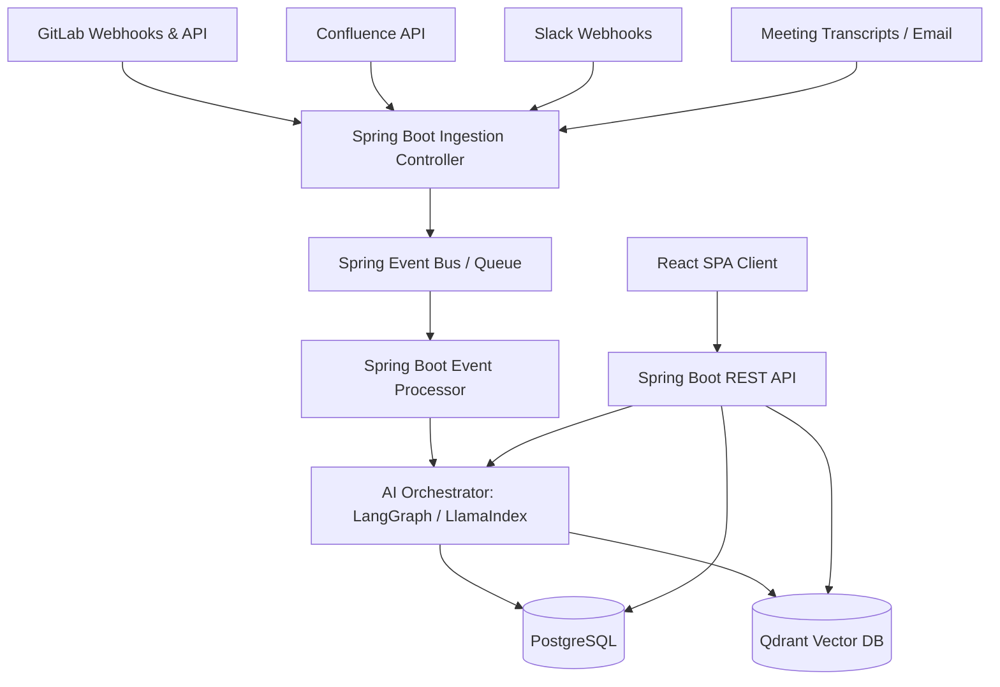

# Architecture Document - AI Alignment Engine (Axis)

## 1. High-Level Architecture
The AI Alignment Engine operates as a three-tier system comprising an **Ingestion Pipeline**, a **Semantic Core (Intelligence Layer)**, and a **Role-Aware Delivery Platform**.

## 2. Technology Stack
* **Frontend:** React, TypeScript, Vite, Vanilla CSS.
* **Backend:** Spring Boot (Java 17/21), Spring Data JPA, Spring Security.
* **AI Orchestration:** Python (FastAPI/LangGraph) or Spring AI / LangChain4j for LLM integration. (We will use a Python agent service alongside the Spring Boot backend to run LangGraph and LlamaIndex natively for complex reasoning tasks).
* **Databases:**
  * **PostgreSQL:** For relational metadata (users, features, project structures, audit event logs).
  * **Qdrant:** For vector embeddings of conversations, code blocks, Confluence pages, and requirement texts.
* **Containerization & Deployment:** Docker, Docker Compose, Kubernetes.

## 3. Component Architecture

### 3.1. Ingestion Layer (Spring Boot Backend)
The Ingestion Layer is responsible for providing HTTP endpoints to receive webhook payloads from GitLab, Slack, and other systems. It normalizes all external payloads into a standard internal `ActivityEvent` format and stores them in the immutable Event Log in PostgreSQL.

### 3.2. AI Intelligence Layer (Python FastAPI / LangGraph Agent Service)
The Spring Boot backend delegates complex AI reasoning tasks to an adjacent microservice written in Python:
* **LLM Classifier Agent:** Takes incoming text updates, runs vector similarity checks against active features, and assigns correct feature tags.
* **Conflict Detection Agent:** Compares requirements text against latest discussions using LLM reasoning models.
* **Impact Analysis Engine:** Builds a dependency mapping from file imports, database relations, and project structures.

### 3.3. Frontend Architecture (React Single Page App)
A client-side application structure using clean React patterns:
* **Context State Management:** Lightweight context providers for authentication and UI preferences.
* **Services Layer:** Abstracted API clients (using Fetch or Axios) matching `API_SPEC.md`.
* **Component Design:** Atom-based visual components (Buttons, Inputs, Cards) styled with clean Vanilla CSS.

## 4. Database & Storage Architecture
The system uses a **Hybrid Polyglot Storage Strategy** to balance relational integrity with semantic search capabilities:
1. **Relational Schema (PostgreSQL):** Represents the feature hierarchy, user models, role mapping, project configurations, and the execution logs of the ingestion system.
2. **Vector Schema (Qdrant):** Houses high-dimensional embeddings (using `text-embedding-3-small` or equivalent open-source embeddings) of chunks of requirements, emails, transcripts, and slack messages to allow semantic lookup.
3. **Graph Concept:** Although stored in PostgreSQL, features and their dependencies are represented as nodes and edges via relationship tables to construct the **Feature Intelligence Graph**.

## 5. Authentication & Security Flow
The application uses JSON Web Tokens (JWT) for secure stateless authentication:
1. The user logs in via the React frontend.
2. The Spring Boot API verifies the user using Spring Security, looking up records in the PostgreSQL database.
3. Upon validation, the server issues a JWT signed with an HS512 secret.
4. For all subsequent requests, the frontend sends the token in the `Authorization: Bearer <JWT>` header.
5. Role-Based Access Control (RBAC) validates whether the user is a `DEVELOPER`, `PRODUCT_OWNER`, `QA_ENGINEER`, or `CLIENT` to deliver role-aware context views.

## 6. Deployment Architecture
For local development, the stack is orchestrated using `docker-compose.yml` including:
* PostgreSQL container on port `5432`.
* Qdrant container on port `6333`.
* Spring Boot API on port `8080`.
* FastAPI Python Agent service on port `8000`.
* React UI on port `5173`.

In production, these services are deployed as individual pods in a Kubernetes cluster, utilizing secure ingress resources and environment secret injection.

## 7. Design Decisions
* **Decoupled Python Agent Service:** We chose to run LangGraph and LlamaIndex in a dedicated Python microservice rather than using Java-based equivalents. This leverages the mature Python AI ecosystem and keeps Spring Boot lightweight for transactional REST APIs.
* **Event-Sourced Activity Logs:** Storing raw incoming webhook payloads directly in an immutable relational table before parsing allows for message replayability, debugging, and backfilling vector databases if embedding strategies change.
* **Strict Separation of Vector and Relational Queries:** The frontend never directly accesses Qdrant. The Spring Boot backend acts as a gateway, fetching semantic IDs from Qdrant and populating rich relational details from PostgreSQL before returning results.
