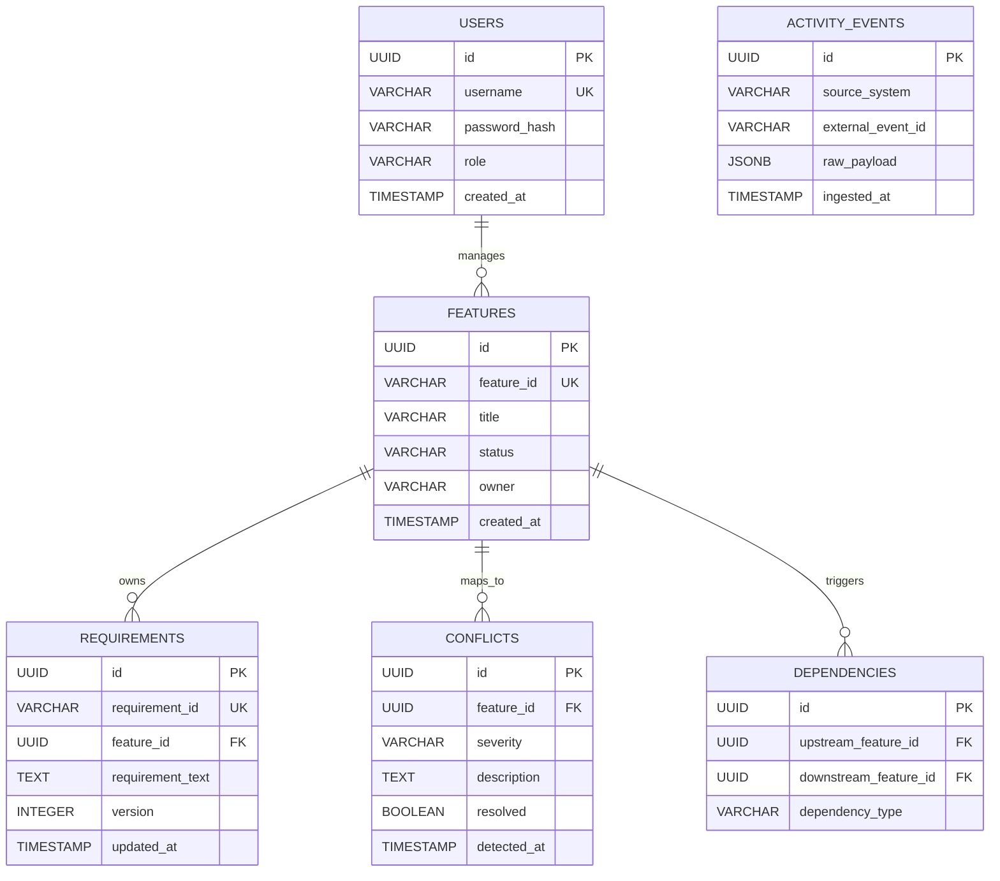

# Database Schema Specification - AI Alignment Engine (Axis)

This document contains structural schemas for both the **PostgreSQL Relational Storage** and **Qdrant Vector Storage**.

---

## 1. Entity-Relationship (ER) Diagram

---

## 2. Table Definitions (PostgreSQL)

### 2.1. `users`
Stores system users and Role-Based Access Control properties.
* `id`: `UUID` (Primary Key, Default: `gen_random_uuid()`)
* `username`: `VARCHAR(100)` (Unique, Not Null)
* `password_hash`: `VARCHAR(255)` (Not Null)
* `role`: `VARCHAR(50)` (Not Null, Enum: `DEVELOPER`, `PRODUCT_OWNER`, `QA_ENGINEER`, `CLIENT`)
* `created_at`: `TIMESTAMP` (Not Null, Default: `CURRENT_TIMESTAMP`)

### 2.2. `features`
Core tracking objects corresponding to Epics or Features.
* `id`: `UUID` (Primary Key)
* `feature_id`: `VARCHAR(50)` (Unique, Not Null - e.g., `FEAT-101`)
* `title`: `VARCHAR(255)` (Not Null)
* `status`: `VARCHAR(50)` (Not Null - e.g., `BACKLOG`, `IN_PROGRESS`, `DONE`)
* `owner`: `VARCHAR(100)` (Not Null)
* `created_at`: `TIMESTAMP` (Not Null, Default: `CURRENT_TIMESTAMP`)

### 2.3. `requirements`
Individual statements that specify feature acceptance constraints.
* `id`: `UUID` (Primary Key)
* `requirement_id`: `VARCHAR(50)` (Unique, Not Null)
* `feature_id`: `UUID` (Foreign Key -> `features(id)`, Cascade On Delete)
* `requirement_text`: `TEXT` (Not Null)
* `version`: `INTEGER` (Not Null, Default: `1`)
* `updated_at`: `TIMESTAMP` (Not Null, Default: `CURRENT_TIMESTAMP`)

### 2.4. `activity_events`
The immutable audit log for all webhook event payloads.
* `id`: `UUID` (Primary Key)
* `source_system`: `VARCHAR(50)` (Not Null, e.g. `GITLAB`, `SLACK`, `CONFLUENCE`)
* `external_event_id`: `VARCHAR(100)` (Nullable, event ID from source webhook)
* `raw_payload`: `JSONB` (Not Null)
* `ingested_at`: `TIMESTAMP` (Not Null, Default: `CURRENT_TIMESTAMP`)

### 2.5. `conflicts`
Identified alignment failures detected by AI Agents.
* `id`: `UUID` (Primary Key)
* `feature_id`: `UUID` (Foreign Key -> `features(id)`)
* `severity`: `VARCHAR(20)` (Not Null, e.g. `LOW`, `MEDIUM`, `HIGH`)
* `description`: `TEXT` (Not Null)
* `resolved`: `BOOLEAN` (Not Null, Default: `FALSE`)
* `detected_at`: `TIMESTAMP` (Not Null, Default: `CURRENT_TIMESTAMP`)

### 2.6. `dependencies`
Represents graph relations showing feature coupling dependencies.
* `id`: `UUID` (Primary Key)
* `upstream_feature_id`: `UUID` (Foreign Key -> `features(id)`)
* `downstream_feature_id`: `UUID` (Foreign Key -> `features(id)`)
* `dependency_type`: `VARCHAR(100)` (e.g. `API_CONTRACT`, `RELEASE_BLOCKER`)

---

## 3. Qdrant Vector Collection Configuration
For semantic queries, we maintain a collection in Qdrant called `axis_artifacts`.

### 3.1. Vector Configuration
* **Dimension:** `1536` (standard dimension for `text-embedding-3-small` or similar models)
* **Metric:** `Cosine`

### 3.2. Payload Fields (Metadata)
* `artifact_id`: `String` (Corresponds to PostgreSQL UUID from `activity_events`, `requirements`, or custom message identifiers)
* `feature_id`: `String` (Link to feature)
* `source_type`: `String` (Enum: `slack`, `gitlab_issue`, `gitlab_commit`, `transcript`, `confluence_page`)
* `timestamp`: `Integer` (Epoch timestamp for filtering)
* `content_text`: `String` (The actual indexed text block)

---

## 4. Indexing Recommendations
To optimize query response times:
1. **Relational Indexing (PostgreSQL):**
   * Create index on `activity_events(source_system, ingested_at)` to speed up ingestion logs dashboard.
   * Create index on `requirements(feature_id)` to optimize feature fetching.
   * Create index on `conflicts(resolved)` to fetch active conflicts quickly.
   * Create `GIN` index on `activity_events(raw_payload)` to enable fast querying inside the JSONB webhook logs.
2. **Vector Indexing (Qdrant):**
   * Set up Payload Indexing on `feature_id` and `source_type` to allow fast pre-filtering during semantic search.
